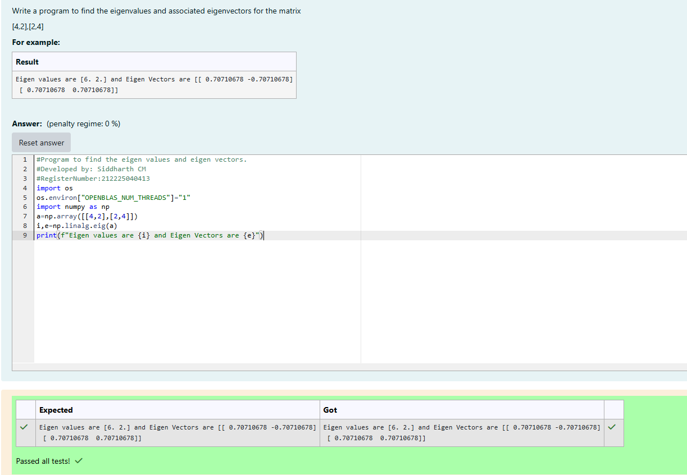

# EIGENVALUES-AND-EIGENVECTORS
## Aim:
To write a python program to find the Eigenvalues and Eigen Vectors
## Equipment’s required:
1. 	Hardware – PCs
2. 	Anaconda – Python 3.7 Installation / Moodle-Code Runner
## Algorithm:

### Step1 : Import the NumPy library.

### Step 2: Create and store the matrix A.

### Step 3: Compute the eigenvalues and eigenvectors using np.linalg.eig().

### Step 4: Display the eigenvalues and eigenvectors.

## Program:
```python

#Program to find the eigen values and eigen vectors.
#Developed by: Siddharth CM
#RegisterNumber:212225040413
import os 
os.environ["OPENBLAS_NUM_THREADS"]="1"
import numpy as np
a=np.array([[4,2],[2,4]])
i,e=np.linalg.eig(a)
print(f"Eigen values are {i} and Eigen Vectors are {e}")

```
## Output:


## Result:
Thus the Eigenvalue and Eigenvector is successfully solved using python program
